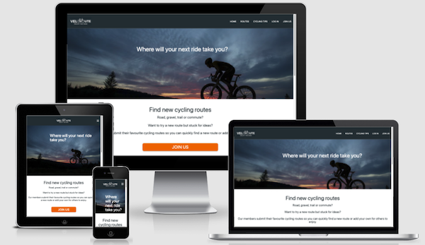

# VeloRoute Website

Cycling is a global and accessible sport that has shown a huge increase in popularity over recent years. The global market for bicycles alone is in excess of $54 billion dollars. Alongside the growth in bicycle sales there has been significant growth in cycling related products such as GPS cycle computers and related software platforms that allow users to record, analyse and share their rides.

VeloRoute has been developed to allow users to share their favourite cycling routes, to search routes that other users have added to the site, to rate routes that have been added and to link to the routes that have been saved to platforms such as Strava and MapMyRide so that the routes can then be downloaded to their GPS devices.

The site was developed using knowledge gained from the Code Institute HTML Essentials, CSS Essentials, User Centric Frontend Development, Interactive Frontend Development and Backend Development modules.

View the live website [here.](https://matty-el.github.io/trail-running-uk/)

## Contents

1.  [User Experience Design](#user-experience-design)
2.  [Features](#features)
3.  [Technologies Used](#technologies-used)
4.  [Testing](#testing)
5.  [Deployment](#deployment)
6.  [Credits](#credits)

## User Experience Design

### Strategy

The key goals for developing the website are:

-   To provide users with an attractive interactive website that enables them to search for and find new cycling routes
    and find tips relating to cycling and cycling safety.
-   To allow users to securely register with VeloRoute and set up a username and password.
-   To allow returning users to log in to VeloRoute.
-   To enable users to add their favourite cycling routes.
-   To allow users to edit or delete their cycling routes.
-   To allow users to rate cycling routes that have been added to VeloRoute.
-   To allow admin users to edit cycling route categories and cycling tips.

### Scope

#### User Stories

#### Website Owner

-   As the website owner, I want branding to be clear and consistent across the website so that the user has a consistent experience.
-   As the website owner, I want the website latency to be optimised so that users are less likely to abandon the website whilst using it.
-   As the website owner, I want the website to be search engine optimised so that users can easily find our website.
-   As the website owner, I want the website to be accessible to all users so that all users can use our website.
-   As the website owner, I want the website to be conformant to web development best practices so that I know the development quality meets required standards.
-   As the website owner, I want the  website to be compatible with different browsers so that users have a consistent experience no matter which browser they use.

#### Users

-   As a user, I want to be able to access the website on all types of device so that i can use the device that is most convenient to me at the time.
-   As a user, I want a website that is clearly laid out and easy to navigate so that I can find the information i am looking for.
-   As a user, I want to register with VeloRoute with a secure username and password.
-   As a user, I want to find new cycling routes so that I can see try new recommended routes.
-   As a user, I want to be able to add my favourite cycling routes to the website.
-   As a user, I want to be able to edit or delete routes that I have previously added to the VeloRoute.
-   As a user, I want to be able to rate cycling routes that have been added to the website.
-   As a user, I want to be able to follow a link to cycling routes that have been added to VeloRoute so that I can view the
    cycling route on platforms such as Strava.

#### Admin Users

-   As an admin user, I want to be able to log in to VeloRoute and have access to the same functionality that a standard website user has.
-   As an admin user, I want to be able to edit cycling route categories.
-   As an admin user I want to be able to edit cycling tips so that I can add or delete cycling tips.

### Structure

The VeloRoute website has been designed to provide an attractive, simple and easy to navigate website. The site has been developed to enable visitors to search for rides that have been submitted by users and to securely register and submit their own cycling routes.

The website has the following key elements:

-   A simple landing page design that provides information about VeloRoute and that presents featured cycling routes to the user.
-   A registration page that allows users to register with VeloRoute.
-   A log in page so that registered users can log in to VeloRoute.
-   A Routes page that allows users to search rides that have been submitted by registered users (this page is also
    where registered users can view and edit or delete rides that they have previously added to VeloRoute).
-   An Add Route page for users to add their favourite cycling routes to VeloRoute.
-   A Cycling Tips page offering tips related to cycling.
-   A Manage Categories page for admin users to edit route categories.
-   A Manage Cycling Tips page for admin users to edit cycling tips.
-   A footer containing VeloRoute social media links and copyright information.

_Notes:_

_........_

### Skeleton

#### Wireframes

The wireframes were developed using [Balsamiq](https://balsamiq.com/).

-   Small device [wireframes](design/velo-route-small-device.png).
-   Medium device [wireframes](design/velo-route-medium-device.png).
-   Large device [wireframes](design/velo-route-large-device.png).

After the initial design was finalised the following changes were made:

-   Change one ......

### Surface

VeloRoute features a clean and simple design with .... background and ... text to provide good contrast....

#### Branding

A simple VeloRoute logo was created using Canva.

#### Colours

A simple colour palette using #202020 for backgrounds and #fefefe for text to provide a good contrast whilst avoiding the potential eyestrain of using pure black and white. Images are used to add colour to the website and have been specifically chosen to emphasise the outdoor aspect of trail running.

#### Typography

Poppins font has been utilised for all text across the website. This is a simple and modern font available from the Google Fonts library which is unobtrusive and easy to read. Font Awesome icons have been utilised for footer links to social media sites.

## Features

### Existing Features

#### Sections

#### Landing Page

-   Trail Running UK logo.
-   A navigation menu on the top right of the website hero section that allows the user to navigate the website by clicking the links or open a newsletter form by selecting the Newsletter menu item. The navigation menu collapses to a burger icon on smaller devices.
-   The newsletter form can be populated with mandatory first name, last name, email address and race distance preference to sign up to the Trail Running UK newsletter. The newsletter form is integrated with EmailJS and sends a confirmation email to the user to say they are now signed up

*Note: The final version of the newsletter form will submit data to a back-end database.*

#### Register Page

-   This section of contains a slideshow with images of trail running locations around the UK and text highlighting some of the key benefits of trail running as a sport and a quotes section for inspiration.

#### Log In Page

-   Buttons to select trail running locations in the UK and running clubs and sports stores local to the user.
-   The Best Trails in Your Region button populates trail running locations around the UK with a Google maps API integration displaying markers and marker clusters. Information about trail running is populated on clicking the button.
-   The Local Running Clubs button geolocates the user via a Google Maps API integration and populates the map with running clubs local to the user. Information about the benefits of joining a running club is populated on clicking the button.
-   The Local Sports Stores button geolocates the user via a Google Maps API integration and populates the map with sports stores local to the user. Information about the gear required to start trail running is populated on clicking the button.

#### Routes Page

-   A section with introductory text and a map section with dropdown boxes to select a region and a race.
-   On selecting a region the user is presented with races in that region. On selecting a race the information section is populated with details about the race and the map is centred on the race location and a marker added to the map.

#### Cycling Tips Page

-   A section with introductory text and a map section with dropdown boxes to select a region and a race.
-   On selecting a region the user is presented with races in that region. On selecting a race the information section is populated with details about the race and the map is centred on the race location and a marker added to the map.

#### Footer Section

-   This section has copyright wording and links to Facebook, Twitter, YouTube, Instagram and Pinterest social media sites.

_Note: The social media links currently link to the social media websites and not Trail Running UK specific pages_

#### Future features

In future additional content will be added to the website including product reviews, race reviews and a blog related to training and races entered.

## Technologies Used

The following technologies have been used to complete the UX design, capture user stories and defects and assign for development and to develop the Urban Paws website.

### Languages

-   [HTML5](https://en.wikipedia.org/wiki/HTML5) - used for the structure and content of the Trail Running UK website.
-   [CSS3](https://en.wikipedia.org/wiki/CSS) - used to style the Trail Running UK website.
-   [JavaScript](https://www.javascript.com/) / [jQuery](https://jquery.com/)- used for scripts for the why trail running and races sections of the Trail Running UK website and for the newsletter.

### Frameworks - Tools - Libraries

-   [Bootstrap library](https://getbootstrap.com/) - utilised for the carousel, buttons, navigation bar and modal elements of the website.
-   [GitHub](https://github.com/) - for hosting the website repository.
-   [GitPod](https://gitpod.io/) - used as the development environment for the website.
-   [Google Fonts](https://fonts.google.com/) - used to source the Poppins font used throughout the website.
-   [Font Awesome](https://fontawesome.com/) - used to source icons for the footer section of the website.
-   [Balsamiq](https://balsamiq.com/) - utilised for the development of the website wireframes.
-   [Tiny PNG](https://tinypng.com/) - for the compression of images for all pages of the website.
-   [Canva](https://canva.com/) - used for the design of the Trail Running UK website logo.
-   [Google Maps API](https://developers.google.com/maps/documentation/javascript/tutorials) - used to embed the get started section and races section maps on the website.
-   [Google Maps Places API](https://developers.google.com/maps/documentation/places/web-service/overview) - used to find places local to the user for the local running clubs and local sports stores.
-   [Beautify Tools](https://beautifytools.com/javascript-validator.php) - for the validation of the JavaScript code.
-   [Markup validation service](https://validator.w3.org/) - for the validation of HTML5 code.
-   [CSS validation service](https://jigsaw.w3.org/css-validator/) - for the validation of the CSS3 code.
-   [Google Chrome DevTools](https://developers.google.com/web/tools/chrome-devtools) - used to edit changes prior to implementing the code changes, to diagnose problems and for performance, accessibility, best practice and search engine optimisation testing.

## Testing

### Functionality Testing

Each user story has been tested based on the acceptance criteria defined in the attached test plan below. The user stories have been written from the perspective of the website owner and the website user.

[User Acceptance Testing](https://matty-el.github.io/trail-running-uk/testing-files/trail-running-uk-user-acceptance-criteria-testing.pdf).

Results:

### User Story Testing Summary

**As a user, I want to be able to access the website on all types of device so that i can use the device that is most convenient to me at the time.**

-   The website has been tested on large screen desktop devices, laptops, tablets and mobile devices.

**As a user, I want a website that is clearly laid out and easy to navigate so that I can find the information i am looking for.**

-   When the website is loaded on devices with a screen above 768 pixels a full screen hero image is visible with a navigation menu across the top right of the page.
-   When the website is loaded on a device with a screen size below 768 pixels, a full screen hero image is visible with a collapsed burger menu on the top right of the screen.
-   The website is divided into three main sections 'Why Trail Running', 'Get Started' and 'Races'. The user can scroll down to each section or use the navigation links.
-   On clicking the 'Why Trail Running' menu link the page smooth scrolls to the carousel section. Back and advance icons are visible on the carousel as are buttons that allows the user to select a specific image. On clicking the advance icon the image advances to the next slide and on clicking the back icon the image moves to the previous slide. On selecting an image button a different image is selected corresponding to the carousel sequence.
-   On clicking the 'Get Started' menu link the page smooth scrolls to the 'Get Started' section. Introductory text is displayed with a brief introduction to trail running in the UK and the map is populated with markers and clusters showing the best trail running sections around the UK and Ireland. Three buttons are visible 'THE BEST TRAILS', 'LOCAL RUNNING CLUBS' and 'LOCAL SPORTS STORES'.
-   On clicking the 'Races' menu link the page smooth scrolls to the Races section. Introductory text is displayed, and a map is displayed centred on the UK. Dropdown menus are visible for the selection of a region and a race and on selecting a race information about that race is displayed along with a website link and a race location marker is populated on the map.
-   On scrolling to the bottom of the page the user is presented with social media icons and copyright text.

**As a user, I want to find out more about trail running and it's benefits so that I can see if it is a sport I would like to participate in.**

-   When the user clicks on the 'Why Trail Running' navigation link the webpage smooth scrolls to the carousel section.
-   The carousel scrolls through 5 images which contain text related to the benefits of trail running.
-   When the user clicks on the advance (right) control the slide changes to the next slide.
-   When the user clicks on the back (left) control the slide changes to the previous slide.
-   When the user selects a slide button below the text area of the image slides the selected image and text is displayed.
-   A motivational quote is displayed on loading of the webpage beneath the carousel.
-   When the user navigates to the 'Get Started' section they are presented with introductory text and a brief introduction to trail running in the UK and Ireland.

**As a user, I want to be able to find the best trail running locations near to me so that I can identify places to go trail running.**

-   On clicking the 'Get Started' menu link the page smooth scrolls to the get started section.
-   Introductory text is displayed with a brief introduction to trail running in the UK and the map is populated with markers and clusters showing the best trail running sections around the UK and Ireland.
-   On clicking a cluster the map zooms in to reveal further clusters and markers located around the UK and Ireland. The map can be zoomed in and out and the user can move around the map with the standard Google maps functionality.
-   Once the user has navigated away from the best trails - by selecting another button in the 'Get Started' section - when the button is clicked the map will be repopulated with the markers and clusters and the 'BEST TRAILS IN THE UK AND IRELAND' text will be added.

**As a user, I want to be able to find local running clubs so that I can consider becoming a member.**

-   On clicking the 'Get Started' menu link the page smooth scrolls to the 'Get Started' section.
-   Three buttons are visible 'THE BEST TRAILS', 'LOCAL RUNNING CLUBS' and 'LOCAL SPORTS STORES'.
-   On clicking the 'LOCAL RUNNING CLUBS' button the user is geolocated if permissions have been set on their device and if not they are presented with a text box stating that the website wants to know the user location. If the user selects 'Allow' the user is geolocated on the map with an information window stating their location. The map is populated with the 20 closest results based on a 'running clubs' search. Markers are added to the map for each search returned.
-   When the user clicks on a marker they are presented with an information window with details of the running club and a hyperlink to the running club website. When the hyperlink is clicked the running club website opens on a new tab in the user's browser.

**As a user, I want to be able to find local sports shops that sell the gear I need so that I can participate in trail running.**

-   On clicking the 'Get Started' menu link the page smooth scrolls to the 'Get Started' section.
-   Three buttons are visible 'THE BEST TRAILS', 'LOCAL RUNNING CLUBS' and 'LOCAL SPORTS STORES'.
-   On clicking the 'LOCAL SPORTS STORES' button the user is geolocated if permissions have been set on their device and if not they are presented with a text box stating that the website wants to know the user location. If the user selects 'Allow' the user is geolocated on the map with an information window stating their location. The map is populated with the 20 closest results based on a 'sports stores' search. Markers are added to the map for each search returned.
-   When the user clicks on a marker they are presented with an information window with details of the sports store and a hyperlink to the sports store website. When the hyperlink is clicked the sports store website opens on a new tab in the user's browser.

**As a user, I want to find information about races around the world so that I can decide if i want to enter a race.**

-   On clicking the 'Races' menu link the page smooth scrolls to the Races section. Introductory text is displayed and a map is displayed centred on the UK.
-   Dropdown menus are visible for the selection of a region and a race to populate details about the race.
-   When the user selects a region the 'Select a race' dropdown is populated with races in that region.
-   On selecting a race the information section is populated with information relating to the races selected.
-   On selecting a race the map is centred on the location of the race with a marker visible in on the map.

**As a user, I want to sign up for the Trail Running UK newsletter so that I can find out more about trail running in the UK.**

-   When the user clicks on the 'Newsletter' navigation link a modal opens with fields for the user to populate first name, last name, email address, race distance preference a checkbox to sign up to the newsletter and a submit button.
-   On entering details, selecting a preferred race distance and then submitting the form the user is sent an email welcoming them and thanking them for signing up to the newsletter.
-   Once the form is submitted the modal closes and a 'Thank you for signing up to our newsletter. Happy trail running!' message is displayed.
-   If the user does not populate a mandatory field a message is displayed asking them to please populate the field with the required data.
-   If the user enters data in an invalid format the user is presented with a message stating that the data has been entered in the incorrect format.

    **As a user, I want to be able to link to the websites social media so that I can follow on social media.**

-   When the user scrolls to the footer section of the website they are presented with icons to link to social media sites.
-   When the social media icons are selected the website for the social media selected will open in a new tab on the user's web browser.

### Responsiveness

The website was tested for responsiveness using [Google Chrome DevTools](https://developers.google.com/web/tools/chrome-devtools) and [Responsive Design Checker](https://www.responsivedesignchecker.com/).

Results:

[Responsiveness](https://matty-el.github.io/trail-running-uk/testing-files/trail-running-uk-responsiveness-testing.pdf).

### Code Validation

**HTML**

The HTML code was validated using the [W3.org markup validation service](https://validator.w3.org/). The code passed validation with no errors.

**CSS**

The CSS code was validated using the [W3.org CSS validation service](https://jigsaw.w3.org/css-validator/). The code passed validation with no errors.

**JavaScript**

The JavaScript code was validated using the [Beautify Tools JavaScript validator](https://beautifytools.com/javascript-validator.php).

The validator did not highlight any significant errors.

### Compatibility Testing

The site was tested across multiple devices and screen sizes and all expected functionality worked with some minor issues detailed below.

Issues discovered during compatibility testing:

-   The parallax effect does not work on iPhones and iPads so a decision was made to remove this so that there is a consistent experience across devices.

#### Performance, Accessibility, Best Practice and SEO Testing

The website has been tested using the Google Developer Tools Lighthouse feature for both mobile and desktop. Performance issues were identified with desktop and particularly mobile performance - these issues will need to be addressed in future.

**Desktop:**

[Performance 93%, Accessibility 100%, Best Practices 93%, SEO 100%](https://matty-el.github.io/trail-running-uk/testing-files/desktop-lighthouse-report.html).

**Mobile:**

[Performance 63%, Accessibility 100%, Best Practices 93%, SEO 100%](https://matty-el.github.io/trail-running-uk/testing-files/mobile-lighthouse-report.html).

The performance score for mobile devices is sub-optimal and improvements will be required to improve performance in this area.

### Deployment

The Trail Running UK project is hosted on GitHub Pages.

**To deploy the project on GitHub**

1.  Navigate to the menu at the top of the project repository on GitHub and select **Settings**.
2.  Select the **Pages** section on the left-hand menu.
3.  Click on the dropdown menu under **Source** and select **master** branch.
4.  Ensure that the folder selected is the **(root)** folder.
5.  Click the **Save** button.
6.  The page will refresh automatically, and the website is now deployed - a green tick will be visible against a green background with the site URL. It may take a few minutes for the site to be published.

A single master branch has been used for this project.

**To run the project locally**

To clone this project from GitHub.

1.  Open the project repository on GitHub and click the **Code** dropdown button.
2.  Select the **HTTPS** tab and copy the URL.
3.  Open your terminal (Mac OS, Linux) or Git-Bash terminal (Windows).
4.  Change the current working directory to the location where you want the cloned directory to be created.
5.  Type **git clone**, enter a space and then paste the URL copied from GitHub.
6.  Press **Enter** and the local clone will be created in the specified directory.

## Credits

### Content

All text content included in the Urban Paws website is my own with race information researched from https://ultra-x.co/best-and-most-beautiful-ultra-marathons-in-the-world/.

Comments have been included in the code for code that has been sourced and adapted for this website.

### Media

-   All images, with the exception of the topography image below, were licensed for use from [Adobe Stock](https://stock.adobe.com/).
-   The topography image was sourced as a free file from [Spoon Graphics](https://blog.spoongraphics.co.uk/).

### Acknowledgements

-   [Precious Ijege](https://www.linkedin.com/in/precious-ijege-908a00168/?originalSubdomain=ng) for mentor guidance and support.
