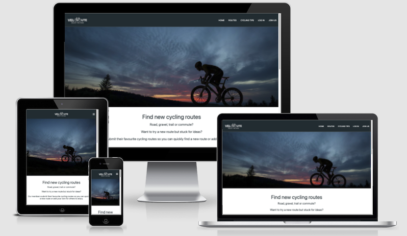

[](https://velo-route.herokuapp.com/)

# VeloRoute Website



Cycling is a global and accessible sport that has shown a huge increase in popularity over recent years. The global market is for bicycles alone is in excess of $54 billion dollars. Alongside the growth in bicycle sales there has been significant growth in cycling related products such as GPS cycle computers and related software platforms that allow users to record, analyse and share their rides.

VeloRoute has been developed to allow users to share their favourite cycling routes, to search routes that other users have added to the site and to link to the routes that have been saved to platforms such as Strava and MapMyRide so that the routes can then be downloaded to their GPS devices.

The site was developed using knowledge gained from the Code Institute HTML Essentials, CSS Essentials, User Centric Frontend Development, Interactive Frontend Development and Backend Development modules.

View the live website [here.](https://velo-route.herokuapp.com/)

---

## Contents

1.  [User Experience Design](#user-experience-design)
2.  [Data Model](#data-model)
3.  [Features](#features)
4.  [Technologies Used](#technologies-used)
5.  [Testing](#testing)
6.  [Deployment](#deployment)
7.  [Credits](#credits)

---

## User Experience Design

### Strategy

The key goals for developing the website are:

-   To provide users with an attractive and intuitive interactive website that enables them to search for and find new cycling routes and find tips relating to cycling and cycling safety.
-   To allow users to securely register with VeloRoute and set up a username and password.
-   To allow returning users to log in to VeloRoute.
-   To enable users to add their favourite cycling routes.
-   To allow users to edit or delete their cycling routes.
-   To allow admin users to edit cycling routes, cycling tips and categories.

### Scope

#### User Stories

#### Website Owner

-   As the website owner, I want branding to be clear and consistent across the website so that the user has a consistent experience.
-   As the website owner, I want the website to be search engine optimised so that users can easily find our website.
-   As the website owner, I want the website to be accessible to all users so that all users can use our website.
-   As the website owner, I want the website to be conformant to web development best practices so that I know the development quality meets required standards.
-   As the website owner, I want the  website to be compatible with different browsers so that users have a consistent experience no matter which browser they use.

#### Users

-   As a user, I want to be able to access the website on all types of device so that I can use the device that is most convenient to me at the time.
-   As a user, I want a website that is clearly laid out and easy to navigate so that I can find the information I am looking for.
-   As a user, I want to register with VeloRoute with a secure username and password.
-   As a user, I want to find new cycling routes so that I can see try new recommended routes.
-   As a user, I want to be able to add my favourite cycling routes to the website.
-   As a user, I want my routes to be displayed on my profile page so that I can see routes I have previously submitted.
-   As a user, I want to be able to edit or delete routes that I have previously added to the VeloRoute.
-   As a user, I want to be able to view cycling tips that have been added to VeloRoute so that I can find tips to help me with my cycling.
-   As a user, I want to be able to rate cycling routes that have been added to the website.
-   As a user, I want to be able to follow a link to cycling routes that have been added to VeloRoute so that I can view the
    cycling route on platforms such as Strava.

#### Admin Users

-   As an admin user, I want to be able to log in to VeloRoute and have access to the same functionality that a standard website user has.
-   As an admin user, I want to be able to edit cycling route categories.
-   As an admin user I want to be able to edit cycling tips so that I can edit or delete cycling tips.
-   As an admin user I want to be able to add cycling tips so that I can present new cycling tips to VeloRoute users.

#### IT Users

-   As an IT user, I want to be able to create, edit and delete cycling route, cycling tip and difficulty level categories so that I can make updates to the database when new categories are required.


### Structure

The VeloRoute website has been designed to provide an attractive, intuitive and easy to navigate website. The site has been developed to enable visitors to search for rides that have been submitted by users and to securely register and submit their own cycling routes.

The website has the following key elements:

-   A simple landing page design that provides information about VeloRoute and that presents cycling routes to the user.
-   A join us page that allows users to register with VeloRoute.
-   A log in page so that registered users can log in to VeloRoute.
-   A Routes page that allows users to search rides that have been submitted by registered users.
-   An Add Route page for users to add their favourite cycling routes to VeloRoute.
-   A user profile page that displays the user's details that they registered with and also displays the routes that the
    user has added to VeloRoute. The profile page is where users can edit routes they have previously submitted.
-   A cycling tips page offering tips related to cycling.
-   A categories page for admin users to edit route, difficulty levels and cycling tip categories.
-   A add cycling tips page for admin users to add and to edit or delete cycling tips.
-   A footer containing information about the VeloRoute team, social media links and copyright information.

### Skeleton

#### Wireframes

The wireframes were developed using [Balsamiq](https://balsamiq.com/).

-   Small device [wireframes](design/velo-route-small-device.png).
-   Medium device [wireframes](design/velo-route-medium-device.png).
-   Large device [wireframes](design/velo-route-large-device.png).

The following changes were made after the initial design.

-   Addition of user profile page with ability for users to edit their previously submitted routes on the profile page.
-   Expanding card panels which can be clicked to reveal the underlying information on routes and cycling tips.


### Surface

VeloRoute features a clean and simple design with #263238 used for dark backgrounds and text and #FAFAFA for light backgrounds and text to provide good contrast. Colour is added to the site through the use of images and buttons as detailed in the colour scheme below.

#### Branding

A simple VeloRoute logo was created using Canva.


#### Colours


A simple colour palette using #263238 for navigation and footer backgrounds and #FAFAFA for text to provide a good contrast whilst avoiding the potential eyestrain of using pure black and white.

All icons with the exception of the social media icons use colour #607D8B. Social media icons in footer are the same colour as the footer text #FAFAFA.

Colours have been used for flash messages and action buttons. #4DD0E1 has been used for the flash messages background, #EF6C00 for the call to action button on the home page, #0097A7 for action buttons throughout the site and #D50000 for all delete buttons.

Images are used to add some additional colour to the website.

#### Typography

Roboto font has been utilised for all text across the website. This is a simple and modern font available from the Google Fonts library which is unobtrusive and easy to read. Font Awesome icons have been utilised for icons throughout the site.

### Defensive Design

The website has been developed incorporating the following defensive design aspects.

#### Error Handling

-   Error pages for 403, 404 and 500 errors which will be displayed to the user if any of these errors occur.

#### Confirm on Delete

-   All areas of the website where users can delete data incorporate modals to prompt the user if they really want to permanently delete the data.

#### Segregation of Duties**

-   The standard users of the website can only create, update and delete routes and can only update and delete routes they have added to Veloroute.

-   The admin user can view and edit any routes that have been added and have full functionality to create, edit and delete routes and cycling tips.

-   A further role of IT user has been added who can only create, update and delete categories as an understanding of the data model is required prior to any changes to these categories. 

#### Data Input Validation

Data validation is incorporated on all data input fields with the following validation applied to:

Join Us Form:

-   Username validated to ensure that it is of length 5 - 15 characters and consists only of numbers and letters. The username is also checked to ensure it does not already exist in the database and a user is notified via a flash message if this is the case.
-   First name and last name fields cannot begin with a space, with a required length between 2 - 20 and letters.
-   Email address field is validated to ensure a valid email address in the correct format is entered.
-   Password is validated to ensure it is between 8 - 15 characters and contains at least one number and one capital and one lowercase letter.

Add Route / Edit Route Form:

-   Category, difficulty and country are dropdown fields with data populated from the database.
-   Route name is validated to ensure it cannot start with a blank space and must consist only of letters with no special characters.
-   The route image is validated to ensure it is a valid URL and has a recognised jpg, jpeg, gif or png extension.
-   The route description is validated to ensure that it is of length between 10 - 300 characters consisting of letters, numbers and standard punctuation.
-   The route distance is validated to ensure it is a number between 1 and 6 numbers in length, so a maximum of 99999.
-   The route link is validated to ensure it is a valid URL.
-   The same validation is in place when a user comes to edit a route.

Add Cycling Tip Form:

-   The category is populated form the database.
-   The cycling tip name is validated for a maximum of 30 characters which must be letters and spaces.
-   The cycling tip image is validated to ensure it is a valid URL and has a recognised jpg, jpeg, gif or png extension.
-   The cycling tip description is validated to ensure that it is of length between 10 - 300 characters consisting of letters, numbers and standard punctuation.
-   The cycling tip link is validated to ensure it is a valid URL.

Add Categories Form:

-   The category input is validated to ensure the user only inputs letter, spaces and no special characters

---

## Data Model

The MongoDB VeloRoute database has seven collections as detailed in the attached diagram.


---

## Features

### Existing Features

#### Sections

#### Home Page

-   VeloRoute logo with a link to the home page.
-   A navigation menu on the top right of the website hero section that allows the user to navigate the website by clicking the navigation links. The navigation menu collapses to a burger icon with sidenav menu on smaller devices. Only the navigation links for Home, Routes, Cycling Tips, Log In and Join Us pages are visible to users who are not logged in to the site.
-   Section one of the Home page includes a hero image and tagline.
-   Section two of the Home page includes introductory text and a call to action button prompting users to join us at VeloRoute.
-   Section three of the Home page includes the six most recently added routes displayed on medium and larger devices and the three most recently added routes are displayed on small devices.

#### Routes Page

-   The Routes page displays all routes that have been added to VeloRoute, with the most recently added routes displayed first.
-   There is the option to search routes to find routes matching specific text search criteria.

#### Cycling Tips Page

-   The Cycling Tips page displays cards with cycling tips relating to categories such as bicycle maintenance, safety and nutrition.
-   Cycling Tips are added by the admin user and cannot be edited by other users. Admin users can edit or delete cycling tips and the delete button is linked to a modal to confirm if the user definitely wants to delete the cycling tip.

#### Log In Page

-   The log in page provides a simple form for the user to log in to VeloRoute with the details they provided on registration.
-   The user is directed to their profile page when they log in.

#### Join Us Page

-   The Join Us page has a simple form for the user to provide their details so that the user can be registered. All inputs are validated.
-   Upon registration the user's details are stored in a MongoDB database with the password hashed for additional security.

#### Profile Page

-   The profile page displays the logged in user's profile details and the routes they have added which are displayed with the most recently added routes listed first.
-   The displayed routes can be edited by selecting the edit button or they can be deleted. There is a cancel button if the user decides that they do not wish to edit the route which returns the user to their profile page. The delete button is linked to a modal that displays a message to ask if the use definitely wants to delete the route.

#### Add Routes Page

-   The Add Routes page allows users who are logged in to the site to add new routes.
-   There is a simple input form that has dropdown select options for choosing a route category, country and difficulty level and input fields for users to add a route name, route image, route description, route distance and a link to the route on the users favourite GPS activity platform, e.g. Strava.

#### Add Cycling Tip Page

-   The Add Cycling Tips page allows admin users to add new cycling tips to the VeloRoute website.
-   There is a simple input form that has a dropdown select option for choosing a cycling tip category and input fields for the admin user to add a cycling tip name, an image, a cycling tip description and a link to further information related to the cycling tip.

#### Manage Categories Page

-   The Manage Categories page allows administration users to add, edit and delete the categories used for the dropdown select options on the Add Route and Add Cycling Tips pages.
-   The categories are displayed as simple cards categorised by each category type with buttons for adding, editing and deleting the categories.

#### Footer Section

-   This section has information about the VeloRoute team, copyright wording and links to Facebook, Twitter, Instagram and Pinterest social media sites.

_Note: The social media links currently link to the social media websites and not VeloRoute specific pages_

#### Future features

-   The ability for users to add ratings to the routes that have been added to VeloRoute.
-   Additional country categorisation to include states, regions, counties etc.
-   Addition of a separate cycling tips page to link from each of the cycling tips to provide a more detailed overview and instructions.
-   A newsletter for users to sign up to updates relating to VeloRoute.

---

## Technologies Used

The following technologies have been used to complete the UX design, capture user stories and defects and assign for development and to develop the Urban Paws website.

### Languages

-   [HTML5](https://en.wikipedia.org/wiki/HTML5) - used for the structure and content of the Trail Running UK website.
-   [CSS3](https://en.wikipedia.org/wiki/CSS) - used to style the Trail Running UK website.
-   [jQuery](https://jquery.com/)- used for scripts for the why trail running and races sections of the Trail Running UK website and for the newsletter.
-   [Python](https://www.python.org/) - used to style the Trail Running UK website.

### Frameworks - Libraries - Other

-   [Materialize](https://getbootstrap.com/) - utilised for the front-end design framework.
-   [MongoDB](https://www.mongodb.com/) - used as the database for the project.
-   [GitHub](https://github.com/) - for hosting the website repository.
-   [GitPod](https://gitpod.io/) - used as the development environment for the website.
-   [Google Fonts](https://fonts.google.com/) - used to source the Roboto font used throughout the website.
-   [Font Awesome](https://fontawesome.com/) - used to source icons for use throughout website.
-   [Balsamiq](https://balsamiq.com/) - utilised for the development of the website wireframes.
-   [Canva](https://canva.com/) - used for the design of the VeloRoute website logo.
-   [Coolors](https://coolors.co/) - used for creating the colour palette image.

### Testing Tools Used

-   [Google Chrome DevTools](https://developers.google.com/web/tools/chrome-devtools) - used to edit changes prior to implementing the code changes, to diagnose problems and for performance, accessibility, best practice and search engine optimisation testing.
-   [Autoprefixer](https://autoprefixer.github.io/) - Autoprefixer is used to parse the CSS and to add vendor prefixes to CSS rules. 
-   [Markup validation service](https://validator.w3.org/) - for the validation of HTML5 code.
-   [CSS validation service](https://jigsaw.w3.org/css-validator/) - for the validation of the CSS3 code.
-   [JShint](https://jshint.com/) - used to check for errors in the JavaScript code. 
-   [PEP8](http://pep8online.com/) - used to check for errors in the Python code.

---

## Testing

Full details of testing are contained in the [testing document](TESTING.md).

### Deployment

#### Requirements

To be able to deploy this project you will need the following:

- Python3 installed
- A Github account 
- A MongoDB account 
- A Heroku account

#### To clone the project locally

To clone this project from GitHub.

1.  Open the project repository on GitHub and click the **Code** dropdown button.
2.  Select the **HTTPS** tab and copy the URL.
3.  Open your terminal (Mac OS, Linux) or Git-Bash terminal (Windows).
4.  Change the current working directory to the location where you want the cloned directory to be created.
5.  Type **git clone**, enter a space and then paste the URL copied from GitHub.
6.  Press **Enter** and the local clone will be created in the specified directory.

#### Working with the local copy

1. Install all the requirements: Go to the workspace of your local copy. In the terminal window of your IDE type: **pip3 install -r requirements.txt**.
2. Create a database in MongoDB  
    - Signup or login to your MongoDB account.
    - Create a cluster and a database.
    - Create seven collections in the database: **categories, cycling_tips, cycling_tip_categories, difficulty_levels, routes, users, countries.**
    - Add the data to the collections. See the VeloRoute [Data Model](#data-model) for details on how the data has been modelled for this project.
3. Create the environment variables 
    - Create a .gitignore file in the root directory of the project.
    - Add the env.py file in the .gitignore.
    - Create the file env.py. This  will contain all the environment variables.

    ```
    Import os
    os.environ.setdefault("IP", "Added by developer")
    os.environ.setdefault("PORT", "Added by developer")
    os.environ.setdefault("SECRET_KEY", "Added by developer")
    os.environ.setdefault("MONGO_URI", "Added by developer")
    os.environ.setdefault("MONGO_DBNAME", "Added by developer")
    ```
4. Run the app: Open your terminal window in your IDE. Type python3 app.py to run the app.

#### Heroku Deployment  
1. Set up local workspace for Heroku 
    - In terminal window of your IDE type: **pip3 freeze -- local > requirements.txt.** (The file is needed for Heroku to know which files to install.)
    - In terminal window of your IDE type: **python app.py > Procfile** (The file is needed for Heroku to know which file is needed as entry point.)
2. Set up Heroku: create a Heroku account and create a new app and select your region. 
3. Deployment method 'Github'
    - Click on the **Connect to GitHub** section in the deploy tab in Heroku. 
        - Search for your Github repository to connect to it.
        - When your repository appears click on **connect** to connect your repository to Heroku. 
    - Go to the settings app in Heroku and go to **Config Vars**. Click on **Reveal Config Vars**.
        - Enter the variables contained in your env.py file. it is about: **IP, PORT, SECRET_KEY, MONGO_URI, MONGO_DBNAME**
4. Push the requirements.txt and Procfile to repository. 
     ```
    $ git add requirements.txt
    $ git commit -m "Add requirements.txt"

    $ git add Procfile 
    $ git commit -m "Add Procfile"
    ```
5. Automatic deployment: Go to the deploy tab in Heroku and scroll down to **Automatic deployments**. Click on **Enable Automatic Deploys**. By **Manual deploy** click on **Deploy Branch**.

Heroku will receive the code from Github and host the app using the required packages. 
Click on **Open app** in the right corner of your Heroku account. The app will open and the live link is available from the address bar. 

**To run the project locally**

To clone this project from GitHub.

1.  Open the project repository on GitHub and click the **Code** dropdown button.
2.  Select the **HTTPS** tab and copy the URL.
3.  Open your terminal (Mac OS, Linux) or Git-Bash terminal (Windows).
4.  Change the current working directory to the location where you want the cloned directory to be created.
5.  Type **git clone**, enter a space and then paste the URL copied from GitHub.
6.  Press **Enter** and the local clone will be created in the specified directory.

---

## Challenges

Two significant challenges were encountered late on in the project:

1.  The Materialize grid system presented an issue where the cards that were utilised flexed perfectly within the Materialize columns to become a uniform width but the image element within the card-image div did not flex perfectly proportionately to the width. As a reult the cards were very slightly different heights resulting in gaps in the rows of cards as they flexed to fill the parent container. I thought that if a container can be utilized as a parent to the image and the image constrained within that container as it flexed then maybe I could achieve a uniform height for all card images. After lots of searching on Google I came across <a href="https://css-tricks.com/scaled-proportional-blocks-with-css-and-javascript/"></a> which seemed to describe what i was thinking. After adapting the code I achieved the desired result. Images with a uniform height and cards aligned.

2.  The second challenge was when the realisation hit me that if my admin user has access to change or delete categories that have been set up in the system that could break the functionality related to other aspects of the site. To resolve this I created an IT user and assigned the ability to create , update and delete categories to this user as this user will understand the data model and can assess any required change before implementing the change and can consult the developer as required. 

---

## Credits

### Content

All text content included in this project is my own..

### Media

All images are my own, have been licensed from Adobe Stock or are freely available on Unsplash. Credits are listed below.

**Hero Image**

-   The hero image is licensed from Adobe Stock.

**Routes Images**

-   The Brossac, Chatignac and Berneuil route photo is my own.
  
-   Wokingham CC Sunday ride route: Photo by <a href="https://unsplash.com/@mmagnemyr?utm_source=unsplash&utm_medium=referral&utm_content=creditCopyText">Martin Magnemyr</a> on Unsplash
  
-   Beauty of the Peak District ride: Photo by <a href="https://unsplash.com/@minkus?utm_source=unsplash&utm_medium=referral&utm_content=creditCopyText">Minkus</a> on Unsplash

-   Epic French Pyrenees route: Photo by <a href="https://unsplash.com/@nincsapro?utm_source=unsplash&utm_medium=referral&utm_content=creditCopyText">Yury Kirillov</a> on Unsplash
  
-   Coast to Alicante route: Photo by <a href="https://unsplash.com/@polina_art?utm_source=unsplash&utm_medium=referral&utm_content=creditCopyText">Polina Rytova</a> on Unsplash
  
-   Mountain trails route: Photo by <a href="https://unsplash.com/@jxk?utm_source=unsplash&utm_medium=referral&utm_content=creditCopyText">Jan Kopřiva</a> on Unsplash

**Cycling Tips Images**

-   Clean and maintain your bike cycling tip: Photo by <a href="https://unsplash.com/@single_lens_reflex?utm_source=unsplash&utm_medium=referral&utm_content=creditCopyText">Dan Burton</a> on Unsplash
  
-   The M Check cycling tip: Photo by <a href="https://unsplash.com/@robertbye?utm_source=unsplash&utm_medium=referral&utm_content=creditCopyText">Robert Bye</a> on Unsplash

-   Coffee and cake cycling tip: Photo by <a href="https://unsplash.com/@nate_dumlao?utm_source=unsplash&utm_medium=referral&utm_content=creditCopyText">Nathan Dumlao</a> on Unsplash
  
-   Clean your chain cycling tip: Photo is licensed from Adobe Stock

### Acknowledgements

-   [Precious Ijege](https://www.linkedin.com/in/precious-ijege-908a00168/?originalSubdomain=ng) for mentor guidance and support.
