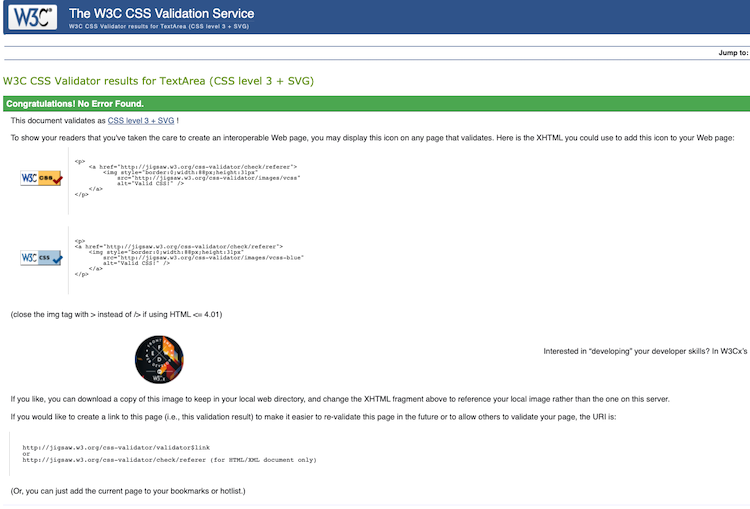
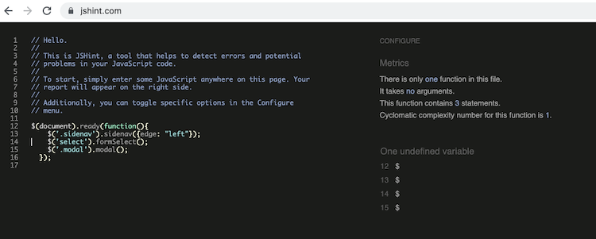
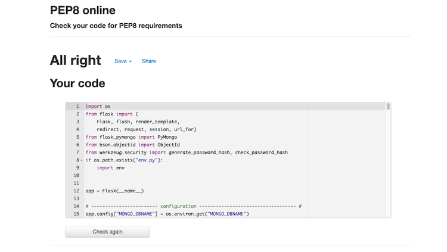
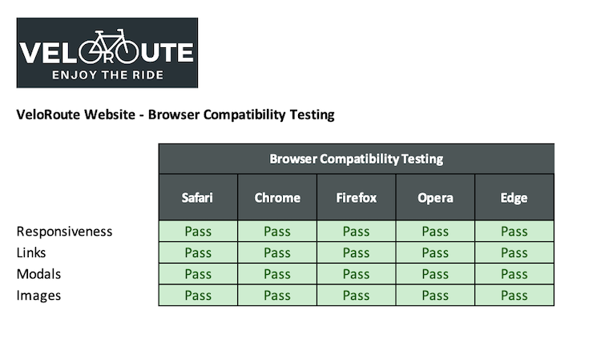
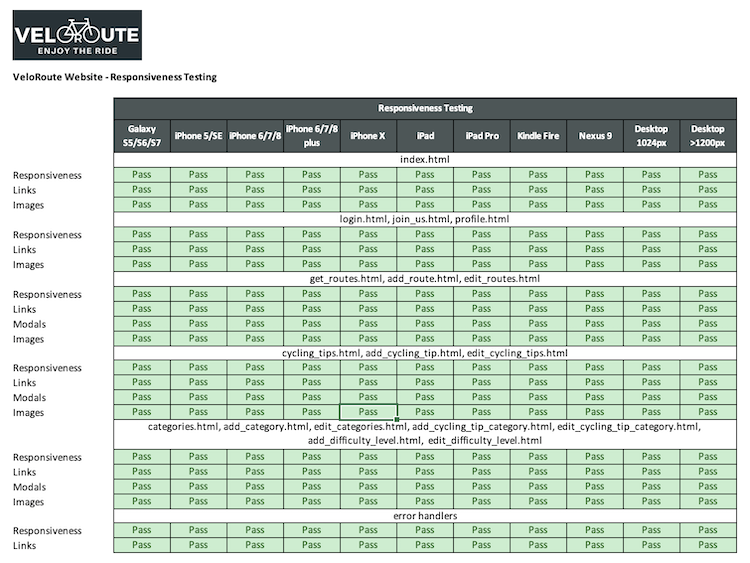

# VeloRoute Testing

---

## Contents 

1.  [Code Validation](#code-validation)
2.  [Browser Compatibility](#browser-compatibility)
3.  [Responsiveness](#responsiveness)
4.  [Lighthouse Reports](#lighthouse-reports)
5.  [User Story Testing](#user-story-testing)
6.  [Defensive Design Testing](#defensive-design-testing)
7.  [Defects and Issues](#defects-and-issues)

---

### CSS Code Validation

The HTML code was validated using the [W3C CSS validation service](https://jigsaw.w3.org/css-validator/).

### HTML Code Validation

The HTML code was validated using the [W3C Markup validation service](https://validator.w3.org/).

No significant errors and all resolved.

This was a manual process to copy and paste the code from each page and review to highlight any errors that were not syntax errors as a result of using Flask and Jinja templates. The only errors found related to a few stray tags and some very minor duplication of attributes and an error stating that validation is not allowed on text area field inputs so this was removed.

### jQuery Code Validation

The jQuery code was validated using the [JSHint validation service](https://jshint.com/).

### Python Code Validation

The Python code was validated using the [PEP 8 Online Validation Service](http://pep8online.com/).

---

## Browser Compatibility

Browser compatibility was good across Safari, Opera, Edge, Firefox and Chrome browsers.

---

## Responsiveness

Resonsiveness was good across all device sizes. Responsiveness of the site has been tested with [Chrome DevTools](https://developers.google.com/web/tools/chrome-devtools) and [Responsive Design Checker](https://www.responsivedesignchecker.com/).

The site has been tested on the following devices:

-   Desktop: 1024px, > 1200px. 
-   Mobile and Tablet: Galaxy S5/S6/S7, iPhone 5/SE, iPhone 6/7/8, iPhone 6/7/8 plus, iPhone x, iPad, iPad Pro, Kindle Fire and Nexus 9

--- 

## Lighthouse Reports

Lighthouse reports were run for all pages of the website. A significant improvement was seen following code validation and user story testing that resulted in issues being addressed such as a lack of a meta tag and missing alt attributes. The second run was not as high as the 95% mark that I initially set for all performance measures. In some cases 95% was exceeded and in others the performance was not optimal but there were no alarmingly low scores. This is something i would address at a future stage. As a result I have marked these as failed in the user story testing summary.

--- 

## User Story Testing

The user stories below have all been tested against defined acceptance criteria. The full test results for all user stories are detailed in attached [testing report](testing-files/velo-route-user-story-testing-final.pdf).

### Website Owner

-   As the website owner, I want branding to be clear and consistent across the website so that the user has a consistent experience.
-   As the website owner, I want the website to be search engine optimised so that users can easily find our website.
-   As the website owner, I want the website to be accessible to all users so that all users can use our website.
-   As the website owner, I want the website to be conformant to web development best practices so that I know the development quality meets required standards.
-   As the website owner, I want the  website to be compatible with different browsers so that users have a consistent experience no matter which browser they use.

### Users

-   As a user, I want to be able to access the website on all types of device so that I can use the device that is most convenient to me at the time.
-   As a user, I want a website that is clearly laid out and easy to navigate so that I can find the information I am looking for.
-   As a user, I want to register with VeloRoute with a secure username and password.
-   As a user, I want to find new cycling routes so that I can see try new recommended routes.
-   As a user, I want to be able to add my favourite cycling routes to the website.
-   As a user, I want my routes to be displayed on my profile page so that I can see routes I have previously submitted.
-   As a user, I want to be able to edit or delete routes that I have previously added to the VeloRoute.
-   As a user, I want to be able to view cycling tips that have been added to VeloRoute so that I can find tips to help me with my cycling.
-   As a user, I want to be able to follow a link to cycling routes that have been added to VeloRoute so that I can view the cycling route on platforms such as Strava.

### Admin Users

-   As an admin user, I want to be able to log in to VeloRoute and have access to the same functionality that a standard website user has.
-   As an admin user, I want to be able to edit cycling route, cycling tip and difficulty level categories.
-   As an admin user I want to be able to edit cycling tips so that I can add or delete cycling tips.
-   As an admin user I want to be able to add cycling tips so that I can present new cycling tips to VeloRoute users.

#### IT Users

-   As an IT user, I want to be able to create, edit and delete cycling route, cycling tip and difficulty level categories so that I can make updates to the database when new categories are required.

---

## Defensive Design Testing

1. Tested in user story testing - When deleting routes, cycling tips or categories on the site a modal will appear where the user has to confirm that they want to delete the item. Once they have confirmed then the item will be deleted.
2. Validation has been included on all form fields as listed below:

Join Us Form:

-   Username validated to ensure that it is of length 5 - 15 characters and consists only of numbers and letters. The username is also checked to ensure it does not already exist in the database and a user is notified via a flash message if this is the case.
-   First name and last name fields cannot begin with a space, with a required length between 2 - 20 and letters.
-   Email address field is validated to ensure a valid email address in the correct format is entered.
-   Password is validated to ensure it is between 8 - 15 characters and contains at least one number and one capital and one lowercase letter.

Add Route / Edit Route Form:

-   Category, difficulty and country are dropdown fields with data populated from the database.
-   Route name is validated to ensure it cannot start with a blank space and must consist only of letters with no special characters.
-   The route image is validated to ensure it is a valid URL and has a recognised jpg, jpeg, gif or png extension.
-   The route description is validated to ensure that it is of length between 10 - 300 characters consisting of letters, numbers and standard punctuation.
-   The route distance is validated to ensure it is a number between 1 and 6 numbers in length, so a maximum of 99999.
-   The route link is validated to ensure it is a valid URL.
-   The same validation is in place when a user comes to edit a route.

Add Cycling Tip Form:

-   The category is populated form the database.
-   The cycling tip name is validated for a maximum of 30 characters which must be letters and spaces.
-   The cycling tip image is validated to ensure it is a valid URL and has a recognised jpg, jpeg, gif or png extension.
-   The cycling tip description is validated to ensure that it is of length between 10 - 300 characters consisting of letters, numbers and standard punctuation.
-   The cycling tip link is validated to ensure it is a valid URL.

Add Categories Form:

-   The category input is validated to ensure the user only inputs letter, spaces and no special characters.

---

## Defects and Issues

### Resolved

1.  It was discovered during testing that the Matrialize modals implementented to confirm the deletion of items across the app were deleting the wrong object. This was resolved by implementing loop indexing which had to be further refined on the Manage Categories page to loop through the individual gategory types to ensure the correct object id was sourced for deletion.
2.  It was noticed during testing that the Materialize sticky footer functionality had stopped working. This was resolved by changing the code for the base.html page to revise the structure and removing an erroneous character from the related CSS code.
3.  A defect was discovered that the images that were presented on the home page were in the reverse order to those on the routes and profile page. This was corrected by adding a reverse sort order to the query for the home page display for small and medium/large devices. The images now display with the most recently added first as with the profile and home pages.
4.  The Materialize grid system presented an issue where the cards that were utilised flexed perfectly within the Materialize columns to become a uniform width but the image element within the card-image div did not flex perfectly proportionately to the width. As a reult the cards were very slightly different heights resulting in gaps in the rows of cards as they flexed to fill the parent container. I thought that if a container can be utilized as a parent to the image and the image constrained within that container as it flexed then maybe I could achieve a uniform height for all card images. After lots of searching on Google I came across  which seemed to describe what i was thinking. After adapting the code I achieved the desired result. Images with a uniform height and cards aligned.
5.  The realisation hit me that if my admin user has access to change or delete categories that have been set up in the system that could break the functionality related to other aspects of the site. To resolve this I created an IT user and assigned the ability to create , update and delete categories to this user as this user will understand the data model and can assess any required change before implementing the change and can consult the developer as required. 4.

### Unresolved

Bugs not resolved:

- No specific bugs as such but would like to improve on the lighthouse reports performance metrics. After the first round of testing and fixing the performance was good but not above the 95% across the board I was hoping for. IMprovements to be made in this area.

---

[Link to README.md file](README.md).